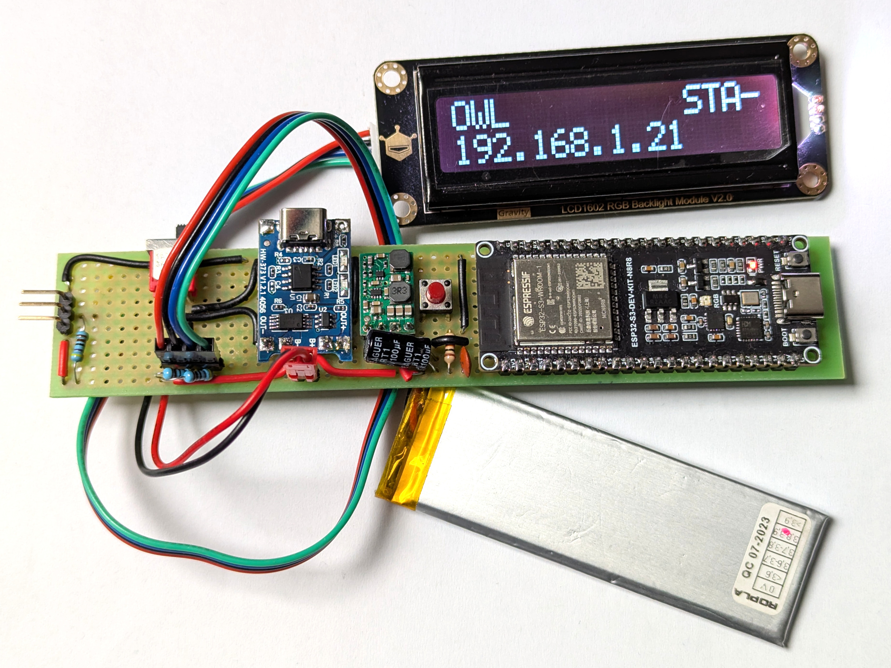

# OWL
## Overview
The OWL (OneWire Locator) is a 1-Wire addresses reader, to be used for identifying modules of the ECAL-P detector in LUXE. This was the topic of my engineering thesis (see [thesis.pdf](thesis.pdf)).



## Features
All the requirements have been met, with OWL being:
 - battery powered, rechargeable and compact;
 - capable of reading 1-Wire addresses and communicating them to the user directly or transmitting them (via UART or Wi-Fi);
 - usable as-is or with Wi-Fi, connecting to a computer for easier use;
 - configurable without requiring dismantling.
The device is based on an ESP32-S3-WROOM-1 module, programmed in C using ESP-IDF and FreeRTOS. It utilizes a push button and an I2C LCD with RGB backlight as the primary user interface, and a LiPo battery as the power supply. Incremental tests of the firmware have helped produce a reliable product, with integration tests confirming it is fully functional. Its estimated single-charge usage time of 17 h is sufficient for it to be convenient to operate.

## Build & run
Assuming `esp-idf` is installed and configured, run
```bash
idf.py set-target esp32s3    # chip used in OWL
idf.py menuconfig            # reconfigure the firmware (OWL component)
idf.py build                 # build the project
idf.py flash monitor         # flash and preview logs, if board is connected
```


